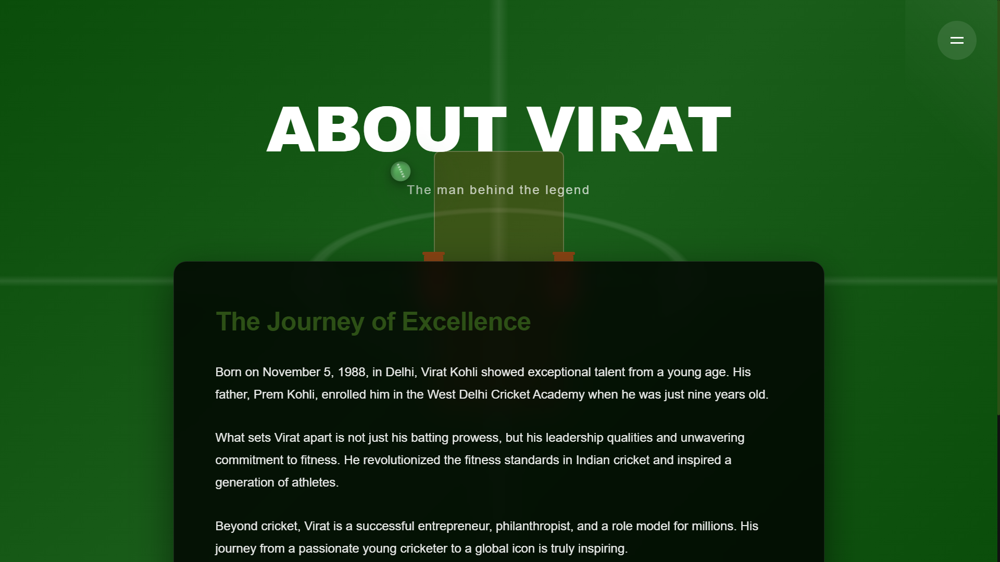
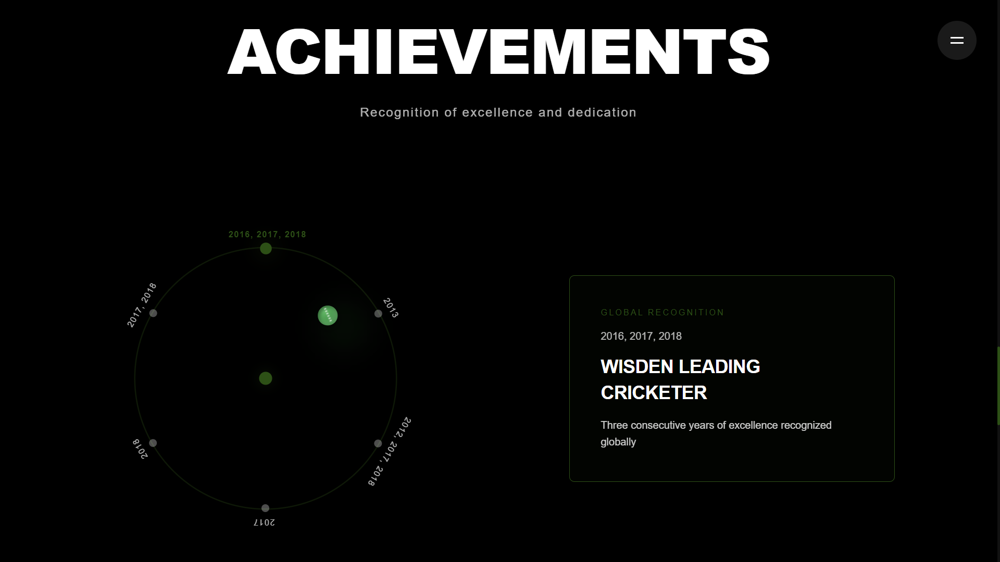

# 🏏 Virat Kohli Signature Store

An interactive, responsive website tribute to **Virat Kohli** — blending sleek UI, 3D animations, and dynamic product pages with modern cricket energy.

---

## 📸 Preview

> *UI inspired by VK’s bold, clean persona*


<br><br>
<br><br>



---

## 🔧 Tech Stack

* Next.js 13 (App Router)
* React 18
* Tailwind CSS
* Framer Motion
* Custom JS Cursor
* Responsive Design

---

## 🎨 Features

* 3D cursor with directional shadow
* Animated product cards with hover effects
* Dynamic product detail pages
* Fully responsive layout
* Smooth transitions and UI interactions

---

## 🚀 Getting Started

```bash
# Clone the repo
git clone https://github.com/yourusername/virat-kohli-signature-store.git
cd virat-kohli-signature-store

# Install
npm install

# Run
npm run dev
```

Visit: `http://localhost:3000`

---

## 📈 Animations & Effects

* Framer Motion: transitions, overlays
* CSS: smooth hover states
* Cursor: shadow trails based on movement

---

## 👊 Inspired By

* Virat Kohli’s intensity & style
* Puma’s sporty UI feel
* Modern eCommerce UX

---


## 🔗 Live Demo

Deployed via [Vercel](https://vercel.com/) → [[https://virat-kohli-store.vercel.app](https://vk-signature-store-ks0541929-9692s-projects.vercel.app/)]

